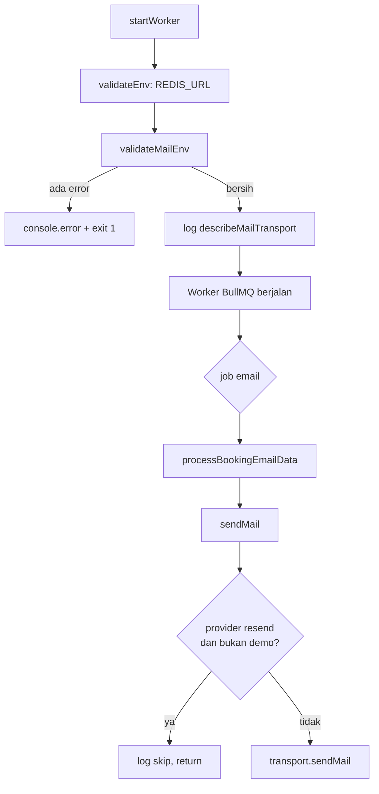

## Context

Lihat `proposal.md` — Why untuk motivasi. Fakta yang ada sekarang dan membentuk pendekatan:

- `src/mailer/mailer.ts` (30 baris) membangun satu transport nodemailer generik dari `SMTP_HOST/SMTP_PORT/SMTP_USER/SMTP_PASS` **di level modul** (`const transport = buildTransport()` baris 15), lalu mengekspor `sendMail` dan `closeMailer`.
- Opsi transport `secure` di-hardcode `false` (baris 10).
- `src/worker.ts` punya `validateEnv()` yang sudah menolak start kalau `REDIS_URL` tidak valid atau `SMTP_PORT` non-numerik — pola gagal-lalu-`process.exit(1)` sudah jadi pola yang diterima di project ini.
- `src/jobs/processors.ts` mendefinisikan `BookingEmailDeps.sendMail` (baris 31-34) sebagai seam injeksi, dan `tests/unit/processors.test.ts` sudah memakainya. Tidak ada coupling ke nodemailer di jalur proses.
- `src/index.ts` mengimpor `closeMailer` untuk graceful shutdown, lalu menjalankan worker hanya pada `RUN_MODE` `all` dan `worker`; mode `api` tidak pernah mengirim email.
- `src/modules/auth/auth.service.ts:27` menyimpan email pengguna apa adanya — tanpa normalisasi case.

## Goals / Non-Goals

**Goals:**

- Satu variabel env menyatakan provider secara eksplisit, dengan default yang menjaga konfigurasi lokal saat ini tetap valid.
- Konfigurasi mail salah pada production gagal saat start worker, bukan gagal diam-diam setelah job berjalan.
- Proteksi kuota free tier Resend sebagai perilaku default, bukan sesuatu yang harus diingat untuk diaktifkan.
- Switch provider terisolasi penuh di `src/mailer/mailer.ts`; `processors.ts` dan test yang ada tidak tersentuh.
- Nol dependency baru.

**Non-Goals:**

- Email HTML, webhook bounce/complaint, template per-provider.
- Mendukung lebih dari dua provider, atau konfigurasi generik lewat env penuh yang mengembalikan fleksibilitas yang justru ingin dihapus.
- Driver `console`/noop untuk test — `BookingEmailDeps.sendMail` sudah menyediakan seam tersebut.
- Ganti provider tanpa restart.
- Normalisasi case email saat registrasi (memengaruhi baris database, di luar scope).

## Decisions

### D1 — Resend dijangkau lewat SMTP, bukan SDK

Nodemailer yang ada sudah menjembatani keduanya, jadi tidak ada dependency baru, tidak ada perubahan pada semantik error/retry BullMQ, dan `package.json`/`bun.lock` tidak tersentuh.

*Alternatif:* SDK `resend` (HTTP). Memberi response id untuk korelasi log dan jalur webhook bounce, tapi menambah dependency, mengubah cara error dibentuk, dan memulai ulang pekerjaan mocking test. Overlay bounce tidak ada dalam scope.

### D2 — `MAIL_PROVIDER` eksplisit, bukan diturunkan dari `NODE_ENV`

Konsisten dengan `RUN_MODE` yang sudah dipakai project. `NODE_ENV` tidak mengizinkan override — preview/staging production tidak bisa dipaksa memakai Mailpit tanpa menebak lewat suffix `.test`/`.local`.

*Alternatif:* turunan dari `NODE_ENV` dengan `MAIL_PROVIDER` sebagai override. Lebih ergonomic, tapi menambah satu lapis resolusi tanpa kebutuhan nyata; mode default sudah cukup jelas.

### D3 — Nilai provider tak dikenal = error, bukan fallback

Ini **sengaja berbeda** dari `RUN_MODE` yang warn+fallback ke `all` (`src/index.ts:34-38`). Analogi itu tidak berlaku: fallback `RUN_MODE` hanya milih **proses apa yang jalan di satu mesin**, sedangkan fallback provider menentukan **ke mana email produksi dikirim**. Typo `MAIL_PROVIDER=rsend` yang di-fallback ke SMTP akan mengirim email produksi ke `localhost:1025` — hilang tanpa satu baris pun di log. Mode ini harus gagal.

### D4 — Guard `DEMO_EMAIL` di `sendMail()`, bukan di `processors.ts`

`sendMail()` adalah satu-satunya titik yang benar-benar bicara ke provider, dan `mailer.ts` satu-satunya modul yang tahu provider mana yang aktif — inilah yang membuat kondisi filter ini bisa dinyatakan di sini. Menaruhnya di sini juga menutupi caller di masa depan tanpa perlu ada yang ingat.

Melewati `processors.ts` berarti fetch DB + render template tetap jalan untuk user yang emang tidak akan dideliver. Itu sesuai requirements (job tetap diproses untuk semua user) dan biayanya kecil dibanding risiko lupa filter di jalur kedua.

*Alternatif:* guard di `processBookingEmailData()` — lebih dekat ke log worker dan teruji lewat seam yang sudah ada, tapi hanya melindungi jalur email booking. Guard ganda di dua tempat harus dijaga sinkron tanpa alat bantu.

### D5 — `DEMO_EMAIL` wajib ada di mode `resend`

Dilindungi by default. Untuk Going live ke semua user, konfigurasi harus diubah secara sadar. Bila `DEMO_EMAIL` opsional, proteksi kuota jadi opt-in dan satu baris yang lupa di-set berarti email asli terkirim ke user asli — persis risiko yang mau dilindungi.

Konsekuensi yang disadari: tidak ada cara "mail semua" tanpa mengubah config. Itu disengaja, bukan kelalaian.

*Alternatif:* kosong = kirim ke semua. Lebih mudah Going live, tapi memindahkan perlindungan dari konfigurasi ke ingatan pemanggil.

### D6 — `RESEND_API_KEY` terpisah, bukan memakai ulang `SMTP_PASS`

Membuat jelas di `.env.example` dan `render.yaml` bahwa isinya API key, bukan password SMTP biasa. Menghemat miskonfigurasi saat setup production. Jumlah variabel bertambah satu baris saja.

### D7 — Host/port/user Resend di-hardcode

`smtp.resend.com:465` dan user `resend` tidak memiliki kebutuhan nyata untuk di-expose. Menjadikannya env hanya membuka cara production terkirim ke host yang salah — kebalikan dari tujuan D3.

### D8 — `secure` diturunkan dari port

Menggantikan hardcode `false` (baris 10) dengan `secure: port === 465`. Satu aturan generik yang benar untuk kedua provider: Mailpit 1025 tetap plaintext, Resend 465 negotiated TLS.

### D9 — `MAIL_FROM` tidak ikut fail-fast

Resend sendiri yang menolak alamat `From` pada domain belum terverifikasi (error 403), jadi itu guarantee dari boundary luar — validasi internal hanya menciptakan behavior yang tak terjangkau. Tradeoff yang diterima: `MAIL_FROM` bawaan (`no-reply@example.com`) akan gagal di sisi provider, retry 3×, lalu di-discard, dan ketahuan dari log worker. Dicatat sebagai checklist deploy di README, bukan sebagai kode.

### D10 — Cek `SMTP_PORT` non-numerik pindah ke validasi provider-aware

Ada di `worker.ts:14-20` dan akan salah gagal bila `MAIL_PROVIDER=resend` dengan sisa `SMTP_PORT` sampah di env — padahal nilainya tidak dikonsultasi di mode itu.

### Bentuk modul

```ts
// src/mailer/mailer.ts
type MailProvider = "smtp" | "resend";
resolveMailProvider(): MailProvider          // baca MAIL_PROVIDER, default "smtp"
resolveTransportOptions(): TransportOptions   // opsi nodemailer sesuai provider
validateMailEnv(): string[]                  // pesan error Bahasa Indonesia
describeMailTransport(): string              // untuk log startup worker
isDemoRecipient(to: string): boolean         // seam murni, case-insensitive + trim
```

`validateMailEnv()` mengembalikan daftar pesan (bukan `console.error` langsung) supaya bisa diuji tanpa menangkap stdout, dan `worker.ts` yang memutuskan exit.



## Risks / Trade-offs

- **`MAIL_PROVIDER=resend` salah di production** → worker gagal start dengan pesan jelas, deploy terlihat merah. Inilah hasil yang diinginkan.
- **Env lama di dashboard Render** → menghapus `SMTP_HOST/USER/PASS` dari `render.yaml` **tidak** menghapus nilainya dari dashboard; Render hanya berhenti meminta nilainya saat blueprint dibuat ulang. Tidak berbahaya selama `MAIL_PROVIDER=resend`, tapi dicatat di README agar tidak mengejutkan.
- **Akun demo tidak dikenali karena perbedaan case** → `isDemoRecipient()` membandingkan case-insensitive + trim, karena `auth.service.ts:27` menyimpan email apa adanya. Tanpa ini, akun demo yang terdaftar `Budi@Example.com` akan selalu ter-skip.
- **Domain `MAIL_FROM` belum terverifikasi di Resend** → semua email gagal dengan 403, retry 3×, discard. Terlihat di log worker, tapi terlambat. Mitigasi: checklist deploy di README.
- **Pekerjaan sia-sia untuk user non-demo** → fetch DB + render template tetap jalan lalu di-skip. Diterima; jumlah email kecil dan ini menjaga job tetap idempoten.
- **Test `mock.module("nodemailer", ...)`** → sesuai `AGENTS.md`, semua file test berbagi satu proses; namespace mock harus lengkap agar tidak merusak linking modul di file lain.

## Migration Plan

Tidak ada migrasi database dan tidak ada perubahan-breaking pada config lokal.

1. Deploy perubahan kode. Default `MAIL_PROVIDER=smtp` menjaga semua environment yang belum menyetelnya tetap berperilaku seperti sekarang.
2. Di Render: set `MAIL_PROVIDER=resend`, `RESEND_API_KEY`, `DEMO_EMAIL`, `MAIL_FROM` (domain terverifikasi). blueprint di-sync ulang.
3. Verifikasi lewat log startup worker: provider aktif dan penerima demo yang terpakai tercetak.
4. Booking uji dari akun demo → email masuk. Booking uji dari akun lain → job `completed`, tanpa kiriman, ada baris log skip.

**Rollback:** set `MAIL_PROVIDER=smtp` dan kembalikan `SMTP_*` di dashboard Render, lalu restart. Tidak ada state yang perlu dibalik.
